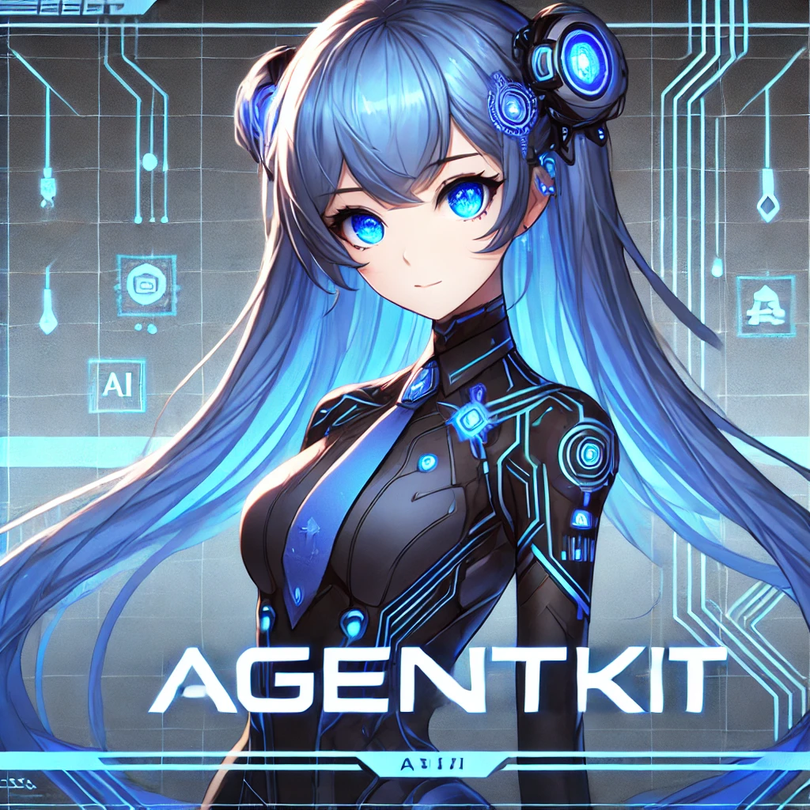

<div align="center">
  <p>
    <a href="https://docs.cdp.coinbase.com/agentkit/docs/welcome">
      
    </a>
  </p>
  <h1 style="font-size: 3em; margin-bottom: 20px;">
    AgentKit
  </h1>

  <p>
    
  </p>

  <p style="font-size: 1.2em; max-width: 600px; margin: 0 auto 20px;">
    Every agent deserves a wallet.
  </p>

[](https://pypistats.org/packages/cdp-agentkit-core)
[](https://www.npmjs.com/package/@coinbase/cdp-agentkit-core)
[](https://star-history.com/#coinbase/cdp-agentkit)
[](https://github.com/coinbase/cdp-agentkit/issues)

</div>

## Table of Contents

- [Overview](#overview)
- [Quickstart](#quickstart)
- [Repository Structure](#repository-structure)
- [Contributing](#contributing)
- [Documentation](#documentation)
- [Security and bug reports](#security-and-bug-reports)
- [Contact](#contact)
- [License](#license)
- [Legal and Privacy](#legal-and-privacy)

## Overview

AgentKit is [Coinbase Developer Platform's](https://docs.cdp.coinbase.com) framework for easily enabling AI agents to take actions onchain. It is designed to be framework-agnostic, so you can use it with any AI framework, and wallet-agnostic, so you can use it with any wallet. AgentKit is actively being built out, and [welcomes community contributions!](#contributing)

<div align="center">
  <a href="https://www.youtube.com/watch?v=-R_mKpdepRE">
    
  </a>
</div>

## Quickstart

### Python

*Prerequisites*:
- [Python 3.10+](https://www.python.org/downloads/)
- [Poetry](https://python-poetry.org/docs/)
- [CDP Secret API Key](https://docs.cdp.coinbase.com/get-started/docs/cdp-api-keys#creating-secret-api-keys)
- [OpenAI API Key](https://help.openai.com/en/articles/4936850-where-do-i-find-my-openai-api-key)

1. Get your agent running:

```bash
# Clone the repository
git clone https://github.com/coinbase/agentkit.git

# Navigate to the chatbot-python example
cd agentkit/cdp-langchain/examples/chatbot-python

# At this point, fill in your CDP API key name, private key, and OpenAI API key in the
# .env.example file.
# Then, rename the .env.example file to .env
mv .env.example .env

# Install dependencies
poetry install

# Run the chatbot
make run
```
2. Select "1. chat mode" and start telling your Agent to do things onchain!

```bash
Prompt: Fund my wallet with some testnet ETH.
-------------------
Wallet: ccaf1dbf-3a90-4e52-ad34-89a07aad9e8b on network: base-sepolia with default address: 0xD9b990c7b0079c1c3733D2918Ee50b68f29FCFD5
-------------------

-------------------
Received eth from the faucet. Transaction: https://sepolia.basescan.org/tx/0x03e82934cd04be5b725927729b517c606f6f744611f0f36e834f21ad742ad7ca
-------------------
Your wallet has been successfully funded with testnet ETH. You can view the transaction [here](https://sepolia.basescan.org/tx/0x03e82934cd04be5b725927729b517c606f6f744611f0f36e834f21ad742ad7ca).
-------------------
```

### Node.js

*Prerequisites*:
- [Node.js 18+](https://nodejs.org/en/download/)
- [CDP Secret API Key](https://docs.cdp.coinbase.com/get-started/docs/cdp-api-keys#creating-secret-api-keys)
- [OpenAI API Key](https://help.openai.com/en/articles/4936850-where-do-i-find-my-openai-api-key)

1. Get your agent running:

```bash
# Clone the repository
git clone https://github.com/coinbase/agentkit.git

# Navigate to the chatbot-typescript example
cd agentkit/cdp-langchain/examples/chatbot-typescript

# At this point, fill in your CDP API key name, private key, and OpenAI API key in
# the .env.example file.
# Then, rename the .env.example file to .env
mv .env.example .env

# Install dependencies
npm install

# Run the chatbot
npm run start
```
2. Select "1. chat mode" and start telling your Agent to do things onchain!

```bash
Prompt: Fund my wallet with some testnet ETH.
-------------------
Wallet: ccaf1dbf-3a90-4e52-ad34-89a07aad9e8b on network: base-sepolia with default address: 0xD9b990c7b0079c1c3733D2918Ee50b68f29FCFD5
-------------------

-------------------
Received eth from the faucet. Transaction: https://sepolia.basescan.org/tx/0x03e82934cd04be5b725927729b517c606f6f744611f0f36e834f21ad742ad7ca
-------------------
Your wallet has been successfully funded with testnet ETH. You can view the transaction [here](https://sepolia.basescan.org/tx/0x03e82934cd04be5b725927729b517c606f6f744611f0f36e834f21ad742ad7ca).
-------------------
```

## Repository Structure

AgentKit is organized as a monorepo that contains multiple packages.

```
./
├── cdp-agentkit-core/
│   ├── python/
│   └── typescript/
├── cdp-langchain/
│   ├── python/
│   ├── typescript/
│   └── examples/
└── farcaster-langchain/
    ├── typescript/
    └── examples/
└── twitter-langchain/
    ├── python/
    ├── typescript/
    └── examples/
```

### cdp-agentkit-core

Core primitives and framework-agnostic tools that are meant to be composable and used via AgentKit framework extensions (ie, `cdp-langchain`).
See [CDP Agentkit Core](./cdp-agentkit-core/README.md) to get started!

### cdp-langchain

Langchain Toolkit extension of AgentKit. Enables agentic workflows to interact with onchain actions.
See [CDP Langchain](./cdp-langchain/README.md) to get started!

### farcaster-langchain

Langchain Toolkit extension for Farcaster. Enables agentic workflows to interact with Farcaster, such as to post a tweet.
See [Farcaster Langchain](./farcaster-langchain/typescript/README.md) to get started!

### twitter-langchain

Langchain Toolkit extension for Twitter. Enables agentic workflows to interact with Twitter, such as to post a tweet.
See [Twitter Langchain](./twitter-langchain/README.md) to get started!

## Contributing

**AgentKit is actively looking for community contributions!**

- To see a list of actions and frameworks we'd love to see open-source contributions for, see [WISHLIST.md](./WISHLIST.md).
- To understand the process for contributing to AgentKit, see [CONTRIBUTING.md](./CONTRIBUTING.md).

## Documentation

- [AgentKit Documentation](https://docs.cdp.coinbase.com/agentkit/docs/welcome)
- [API Reference: AgentKit Core Python](https://coinbase.github.io/agentkit/cdp-agentkit-core/python/index.html)
- [API Reference: AgentKit LangChain Extension Python](https://coinbase.github.io/agentkit/cdp-langchain/python/index.html)
- [API Reference: AgentKit Core Node.js](https://coinbase.github.io/agentkit/cdp-agentkit-core/typescript/index.html)
- [API Reference: AgentKit LangChain Extension Node.js](https://coinbase.github.io/agentkit/cdp-langchain/typescript/index.html)

## Security and Bug Reports

The AgentKit team takes security seriously.
See [SECURITY.md](SECURITY.md) for more information.

## Contact

For feature requests, feedback, or questions, please reach out to us via the 
[Coinbase Developer Platform Discord](https://discord.com/channels/1220414409550336183/1304126107876069376).

## License

AgentKit is licensed under the [Apache-2.0](LICENSE.md) license.

## Legal and Privacy

The AgentKit software is novel and experimental, and is therefore provided on an AS-IS basis.
 The software is intended to be used only for the purposes of assisting with designing 
 blockchain transactions and enabling other API integrations using natural language inputs, 
 and is not intended to provide (i) an offer, or solicitation of an offer, to invest in, or to 
 buy or sell, any interests or shares, or to participate in any investment or trading 
 strategy, (ii) accounting, legal, tax advice, investment recommendations or other 
 professional advice or (iii) an official statement of Coinbase. Acts proposed or performed by 
 an agent through AgentKit software are NOT acts of Coinbase. You should consult with a 
 professional advisor before making any decisions based on the information provided by the 
 software. No representation or warranty is made, expressed or implied, with respect to the 
 accuracy, completeness, reliability, security, or suitability of the software or to any 
 information provided in connection with the software. The risk of loss through use of the 
 software can be substantial, and you assume any and all risks of loss and liability. The 
 software may produce output that is inaccurate, incorrect, unpredictable or undesirable, and 
 it is the user's exclusive responsibility to evaluate the output and the use-case and 
 determine whether it is appropriate. The right to use the software is contingent on your 
 agreement to the [CDP Terms of Service](https://www.coinbase.com/legal/developer-platform/terms-of-service) (except to the extent it conflicts with the Apache-2.0 license).