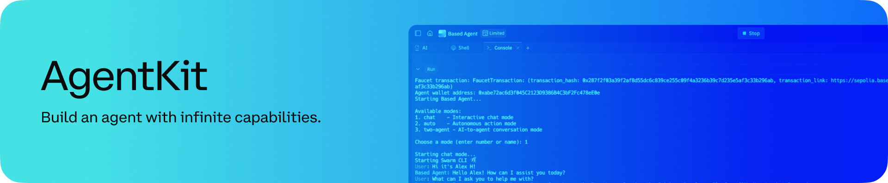

<div align="center">
  <p>
    <a href="https://docs.cdp.coinbase.com/agentkit/docs/welcome">
      
    </a>
  </p>
  <h1 style="font-size: 3em; margin-bottom: 20px;">
    AgentKit
  </h1>

  <p style="font-size: 1.2em; max-width: 600px; margin: 0 auto 20px;">
    Simplify bringing your AI Agents onchain. Every AI Agent deserves a crypto wallet!
  </p>

[](https://pypistats.org/packages/cdp-agentkit-core)
[](https://www.npmjs.com/package/@coinbase/cdp-agentkit-core)
[](https://star-history.com/#coinbase/cdp-agentkit)
[](https://github.com/coinbase/cdp-agentkit/issues)

</div>

## Key Features

- **Framework-agnostic**: Common AI Agent primitives that can be used with any AI framework.
- **Python and Node.js Support**
- **LangChain integration**: Seamless integration with [LangChain](https://python.langchain.com/docs/introduction/) for easy agentic workflows. More frameworks coming soon!
- **Farcaster integration**: Seamless integration of Langchain with [Farcaster](https://docs.farcaster.xyz/) via [Neynar](https://docs.neynar.com) for easy agentic workflows.
- **Twitter integration**: Seamless integration of Langchain with [Twitter](https://developer.twitter.com/en/docs/twitter-api) for easy agentic workflows.
- **Support for various onchain actions**:

  - Faucet for testnet funds
  - Getting wallet details and balances
  - Transferring and trading tokens
  - Registering [Basenames](https://www.base.org/names)
  - Deploying [ERC-20](https://www.coinbase.com/learn/crypto-glossary/what-is-erc-20) tokens
  - Deploying [ERC-721](https://www.coinbase.com/learn/crypto-glossary/what-is-erc-721) tokens and minting NFTs
  - Buying and selling [Zora Wow](https://wow.xyz/) ERC-20 coins
  - Deploying tokens on [Zora's Wow Launcher](https://wow.xyz/mechanics) (Bonding Curve)
  - Wrapping ETH to WETH on Base

  Or [add your own](./CONTRIBUTING.md#adding-an-action-to-agentkit-core)!

## Examples

Check out [cdp-langchain/examples](./cdp-langchain/examples) for inspiration and help getting started!
- [Chatbot Python](./cdp-langchain/examples/chatbot-python/README.md): Simple example of a Python Chatbot that can perform complex onchain interactions, using OpenAI.
- [Chatbot Typescript](./cdp-langchain/examples/chatbot-typescript/README.md): Simple example of a Node.js Chatbot that can perform complex onchain interactions, using OpenAI.

## Repository Structure

AgentKit is organized as a [monorepo](https://en.wikipedia.org/wiki/Monorepo) that contains multiple packages.

```
./
├── cdp-agentkit-core/
│   ├── python/
│   └── typescript/
├── cdp-langchain/
│   ├── python/
│   ├── typescript/
│   └── examples/
└── farcaster-langchain/
    ├── typescript/
    └── examples/
└── twitter-langchain/
    ├── python/
    ├── typescript/
    └── examples/
```

### cdp-agentkit-core

Core primitives and framework-agnostic tools that are meant to be composable and used via AgentKit framework extensions (ie, `cdp-langchain`).
See [CDP Agentkit Core](./cdp-agentkit-core/README.md) to get started!

### cdp-langchain

Langchain Toolkit extension of AgentKit. Enables agentic workflows to interact with onchain actions.
See [CDP Langchain](./cdp-langchain/README.md) to get started!

### farcaster-langchain

Langchain Toolkit extension for Farcaster. Enables agentic workflows to interact with Farcaster, such as to post a tweet.
See [Farcaster Langchain](./farcaster-langchain/typescript/README.md) to get started!

### twitter-langchain

Langchain Toolkit extension for Twitter. Enables agentic workflows to interact with Twitter, such as to post a tweet.
See [Twitter Langchain](./twitter-langchain/README.md) to get started!

## Contributing

AgentKit welcomes community contributions.
See [CONTRIBUTING.md](./.github/CONTRIBUTING.md) for more information.

## Documentation

- [AgentKit Documentation](https://docs.cdp.coinbase.com/agentkit/docs/welcome)
- [API Reference: AgentKit Core Python](https://coinbase.github.io/agentkit/cdp-agentkit-core/python/index.html)
- [API Reference: AgentKit LangChain Extension Python](https://coinbase.github.io/agentkit/cdp-langchain/python/index.html)
- [API Reference: AgentKit Core Node.js](https://coinbase.github.io/agentkit/cdp-agentkit-core/typescript/index.html)
- [API Reference: AgentKit LangChain Extension Node.js](https://coinbase.github.io/agentkit/cdp-langchain/typescript/index.html)

## Security and bug reports

The AgentKit team takes security seriously.
See [SECURITY.md](SECURITY.md) for more information.

## License

Apache-2.0
